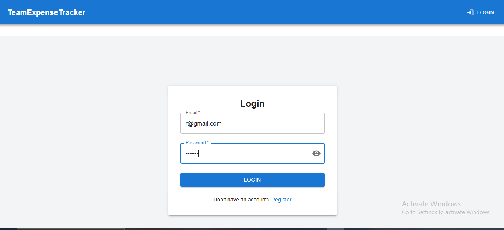
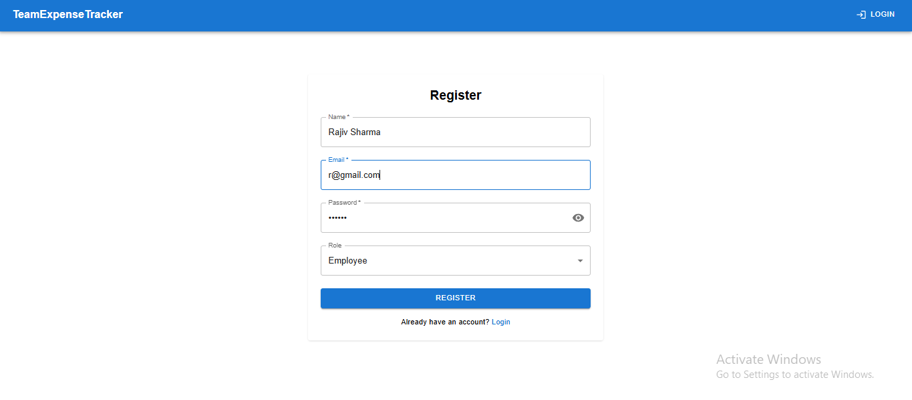
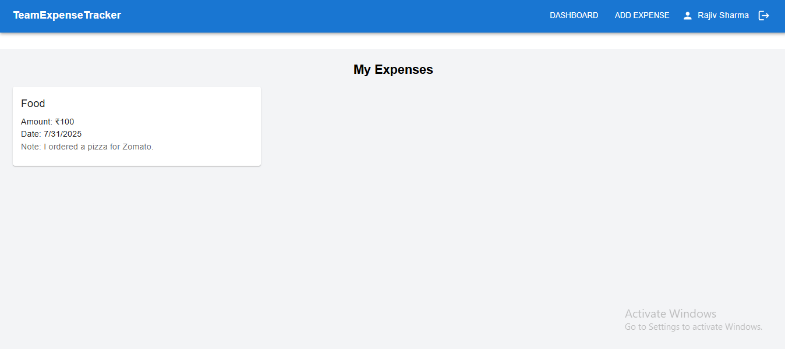
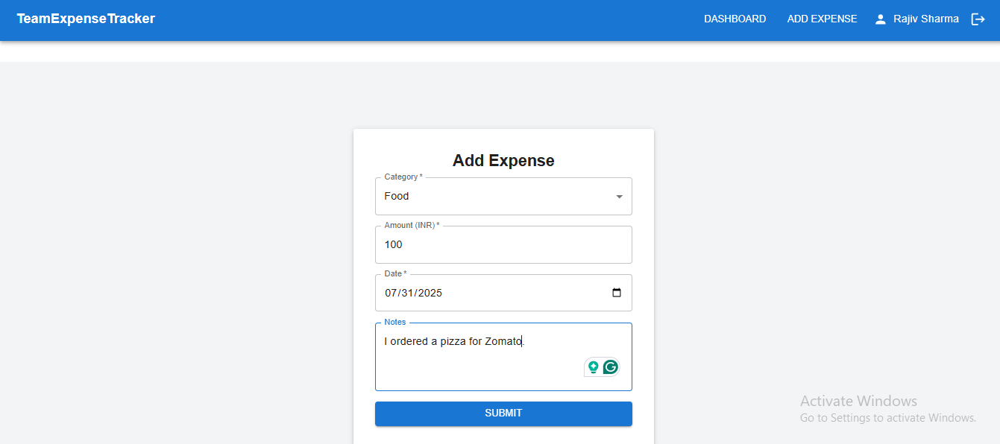
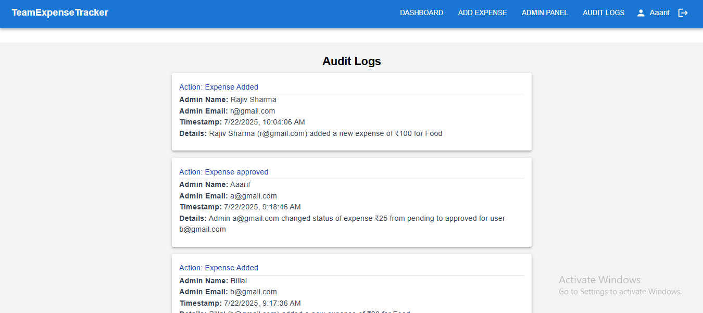
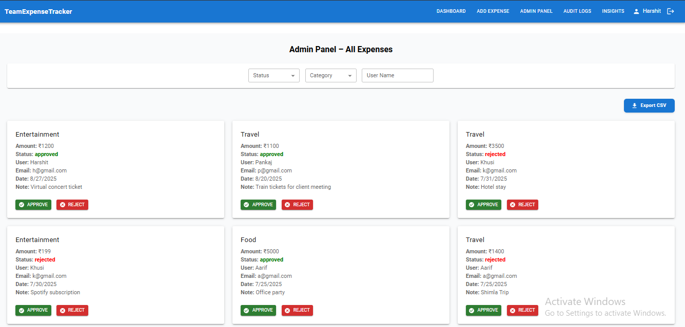
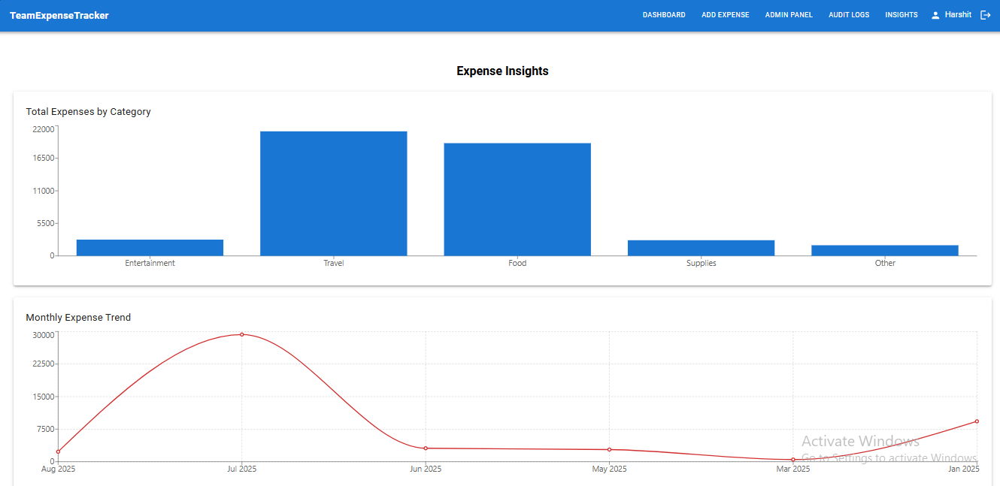

# Expense Tracker 💸

A full-stack MERN (MongoDB, Express, React, Node.js) application to manage and track your personal expenses with authentication, category-wise tracking, and dashboards.
---

## 📦 Features

- User Registration & Login (JWT-based)
- Add, Edit, and Delete Expenses
- Expense Filtering by Date and Category
- Dashboard for Total and Recent Expenses
- Admin Panel to View All Expenses and Audit Logs
- CSV Export for Admins
- Insight Charts using Recharts
- Responsive UI with TailwindCSS / Material UI
- Toast Notifications for Feedback

---

## 🧰 Tech Stack

- **Frontend:** React, Redux Toolkit, TailwindCSS or MUI, Axios
- **Backend:** Node.js, Express.js, MongoDB, Mongoose, JWT
- **Deployment:** Render (Backend), Vercel/Render (Frontend)
- **Charting:** Recharts (Insights)

---

## 🚀 Getting Started

### 1. Clone the Repository

```bash
git clone https://github.com/sharmaHarshit2000/expense-tracker.git
cd expense-tracker
```

### 2. Backend Setup

```bash
cd backend
npm install
```

Create a `.env` file in `backend/`:

```env
PORT=5000
MONGO_URI=your_mongo_db_uri
JWT_SECRET=your_jwt_secret
```

Start the backend:

```bash
npm run dev
```

### 3. Frontend Setup

```bash
cd frontend
npm install
```

Create a `.env` file in `frontend/`:

```env
VITE_API_BASE_URL=https://your-backend-service.onrender.com/api
```

Start the frontend:

```bash
npm run dev
```

---

## ⚙️ Deployment

### Backend (Render):

- Connect GitHub repo
- Add Environment Variables (`MONGO_URI`, `JWT_SECRET`)
- Set build command: `npm install`
- Set start command: `node index.js` or `npm start`

### Frontend (Vercel or Render):

- Set `VITE_API_BASE_URL` to backend's deployed URL
- Set build command: `npm run build`
- Output directory: `dist` (for Vite)

---

## 📁 Folder Structure

```txt
expense-tracker/
├── backend/
│   ├── server.js
│   ├── config/
│   ├── middlewares/
│   │   ├── authMiddleware.js
│   │   ├── errorHandler.js
│   │   └── notFound.js
│   ├── routes/
│   │   ├── authRoutes.js
│   │   ├── expenseRoutes.js
│   │   └── auditRoutes.js
│   ├── controllers/
│   │   ├── authController.js
│   │   ├── expenseController.js
│   │   └── auditController.js
│   ├── models/
│   │   ├── User.js
│   │   ├── Expense.js
│   │   └── AuditLog.js
│   └── utils/
│       └── generateToken.js
│
├── frontend/
│   ├── App.jsx
│   ├── main.jsx
│   ├── components/
│   │   ├── Header.jsx
│   │   ├── ProtectedRoute.jsx
│   │   ├── Footer.jsx
│   ├── pages/
│   │   ├── LoginPage.jsx
│   │   ├── RegisterPage.jsx
│   │   ├── Dashboard.jsx
│   │   ├── AdminPanel.jsx
│   │   ├── ExpenseForm.jsx
│   │   ├── AuditLogs.jsx
│   │   └── Insight.jsx
│   ├── context/
│   │   └── AuthContext.jsx
│   ├── api/
│   │   ├── auth.js
│   │   ├── audit.js
│   │   ├── expense.js
│   │   └── axios.js
│
├── screenshots/
│   ├── login.png
│   ├── register.png
│   ├── dashboard.png
│   ├── expenses.png
│   ├── admin-panel.png
│   ├── audit-logs.png
│   └── insight.png
```

---

## 📸 Screenshots

🧑‍💼 To view **Audit Logs** and **Admin Panel**, login as an **admin** user.

---

### 🔐 Login Page  


---

### 📝 Register Page  


---

### 📊 Dashboard  


---

### 💰 Expenses  


---

### 📁 Audit Logs  


---

### 🛠️ Admin Panel  


---

### 📈 Insights (Charts via Recharts)


---

## 🧑‍💻 Author

**Pawan Patil**  
📧 patilpawan2108@gmail.com  
🔗 [GitHub Profile](https://github.com/pawanpatil2108)
